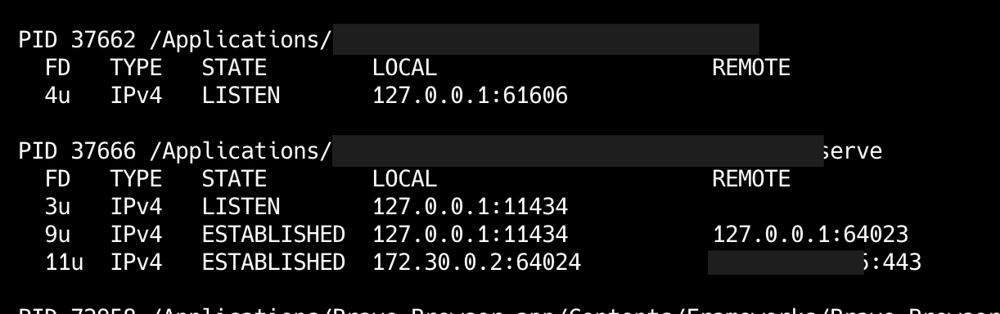

# nprocs — Portable Network Process Viewer

**Nprocs** is a lightweight, portable shell tool that displays **active network connections grouped by process** in a clean, human-readable table. It works on **macOS and Linux**, using only standard UNIX tools and a POSIX-compatible shell.



---

## Installation

1. One-liner installation:
   ```bash
   mkdir -p ~/.local/bin && \
   curl -fsSL https://raw.githubusercontent.com/iocron/nprocs/main/nprocs -o ~/.local/bin/nprocs && \
   chmod +x ~/.local/bin/nprocs && \
   export PATH="$HOME/.local/bin:$PATH" && \
   echo "Installation complete! Run 'nprocs' to start."

2. Make sure .local/bin is in your shellprofile (~/.bash_profile or ~/.zshrc):
   ```bash
   export PATH="$HOME/.local/bin:$PATH"
   ```

---

## Features

- Groups network connections by **process (PID)**
- Displays:
  - File descriptor
  - Address family (IPv4 / IPv6)
  - Connection state (LISTEN, ESTABLISHED, etc.)
  - Local and remote endpoints
- Shows the full command line of each process
- Works with default `awk` (BSD and GNU)
- `/bin/sh` compatible (no Bash required)

---

## Example Output

```text
PID 37662 /usr/bin/myapp
  FD   TYPE   STATE        LOCAL                     REMOTE
  4u   IPv4   LISTEN       127.0.0.1:61606           123.123.123.123
